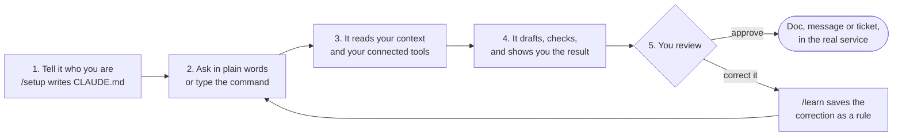

# AI Second Brain

**Weekly reports, meeting notes and morning priorities, done by AI. You review.**

AI Second Brain is a template for Claude Code that turns your editor into a work partner. It reads a profile of who you are, reaches the tools you connect (Google Docs, Drive, Slack, Calendar, Jira, meeting recorders), and runs your recurring work as saved procedures. It shows you each draft, and nothing is sent until you approve it.

[](LICENSE)
[](CHANGELOG.md)
[](#requirements)


## AI can now run your routines, not only chat

Meeting notes, morning priorities, weekly reports, reply drafts. An AI agent in your editor can do all of it and put the result straight into your Google Doc. There is one condition: the system around it has to exist first. It needs your context, your tools and your procedures.

| Ask for | What you get | Example |
| :--- | :--- | :--- |
| [`/daily-update`](.claude/commands/daily-update.md) | A morning list of what matters today, and an evening check against that plan | "Prep my day." |
| [`/meeting-notes`](.claude/commands/meeting-notes.md) | Clean minutes: decisions, action items with an owner and a date, open questions | "Write up this morning's meeting." |
| [`/weekly-report`](.claude/commands/weekly-report.md) | The week's work read in full, weighted by what mattered, written into the same report Doc | "Write this week's progress report." |
| [`/learn`](.claude/commands/learn.md) | A correction saved as a rule, after you confirm it | "Never post to Slack without asking me first. /learn" |

## But building that system yourself starts from an empty folder

- You open an empty folder. Which command first? Which rules? You do not know where to start.
- You copy someone else's setup from a video. It does not fit your work.
- Every Friday you type the same prompt for the weekly report, again, then paste in meeting notes one by one.
- Eight meetings this week. The action items are scattered, and nobody wrote down who owns what.
- You correct the AI on Monday. On Thursday it makes the same mistake, because a new chat starts from zero.

The setup is the hard part, so most people never get past the chat box.

## The fix: start from a system used for real work

This repo is that setup, taken from daily product work and cleaned up for anyone to fork. It ships the profile file, the saved procedures, the connectors and the guardrails. You describe who you are once, connect the tools you already use, and ask in plain language. A natural request follows the same procedure as the slash command, because `CLAUDE.md` routes both to the same file.

| Before | After |
| :--- | :--- |
| Start from an empty folder | Start from a system used for real work |
| Explain your context in every new chat | Fill in your profile once. It reads it before every task |
| Monday morning, ten tabs open to build a report | Ask for the report. Review it in a Google Doc |
| Make the same correction every week | Correct it once, and the next session already knows |

## Who it is for

People whose week is full of repetitive, structured deliverables: product managers, consultants, founders, operators and team leads who live in meetings, Slack and Google Docs. You need to be a little comfortable with a terminal to install it. After that you talk to it. If you want AI that does the work in your real tools, not a chat box that talks about it, this is for you.

## How it works



1. **Tell it who you are.** Open the folder in Claude Code and run `/setup`. It interviews you about your work, projects, team and rules, then writes `CLAUDE.md` for you.
2. **Ask in plain words.** `"Write meeting notes from this morning's call."` You do not have to memorize commands. Typing `/meeting-notes` does the same thing.
3. **It reads your context and tools.** It pulls the transcript from your meeting recorder, your notes, and whatever you connected: calendar, Slack, email, tickets.
4. **It drafts, checks, and shows you.** Big jobs fan out to cheaper subagents that read in parallel. A reviewer subagent checks the draft against your rules before you see it.
5. **You review.** Approve, and it creates the Google Doc or sends the message as you. Correct it, then run `/learn`, and the lesson is kept for every future session.

## What it can do

| Ask for | What you get | Use it for |
| :--- | :--- | :--- |
| [`/daily-update`](.claude/commands/daily-update.md) | Morning mode reads your calendar, email, Slack and yesterday's meetings, then gives the top priorities. Evening mode scores what got done against the morning plan | Starting the day with a plan. Closing the day with an honest carryover |
| [`/meeting-notes`](.claude/commands/meeting-notes.md) and [`/mom`](.claude/commands/mom.md) | Minutes from a transcript or rough notes: decisions, action items with owner and date, open questions. An unclear owner is flagged, not guessed | Notes after a client call. Action items nobody loses |
| [`/meeting-prep`](.claude/commands/meeting-prep.md) | A one-page brief: who attends, context from past notes, open items, questions worth raising | Walking into an important meeting with the context in hand |
| [`/weekly-report`](.claude/commands/weekly-report.md) | A progress report built from every meeting and note of the week, weighted by delivered work, not recency. It updates the existing Drive Doc in place | The weekly update for your manager |
| [`/follow-ups`](.claude/commands/follow-ups.md) | A list of open loops: promises made, replies owed, people waiting on you. Drafts for each, sent only after you approve each one | Clearing overdue replies on Slack and email |
| [`/prd`](.claude/commands/prd.md) | A PRD that starts with the right questions: who needs this most, what they do today instead, how you will know it worked. If the PRD is already in Drive, it revises that one | Specs for a new feature |
| [`/mockup`](.claude/commands/mockup.md), [`/deck`](.claude/commands/deck.md), [`/artifact`](.claude/commands/artifact.md) | One HTML file that opens in any browser: a clickable prototype with presenter controls, a keyboard driven slide deck, or an explainer page | A demo tomorrow. A presentation. A proposal to send |
| [`/learn`](.claude/commands/learn.md) | Lessons from the session, drafted as rules. You confirm before anything is saved | Making a correction permanent |

More commands ship for notes and search (`/capture-note`, `/search`, `/remember`, `/organize-inbox`), weekly reflection and planning, tickets, user stories and incident reviews. Every command is one markdown file in `.claude/commands/`.

## Quick start

**1. Clone and install.** The installer checks your tools, creates `CLAUDE.md` from the template and prepares `.env`. It never overwrites a file you already customized.

```bash
git clone https://github.com/BrianArfi/ai-second-brain.git
cd ai-second-brain
bash install.sh
```

**2. Start Claude Code and let it get to know you.**

```bash
claude
```

Then type:

```
/setup
```

It interviews you one topic at a time and writes your `CLAUDE.md`. To do it by hand instead, edit `CLAUDE.md` with [`docs/CUSTOMIZING.md`](docs/CUSTOMIZING.md) next to you. Set the **Timezone** line in `CLAUDE.md` to your IANA zone, for example `Europe/London`. `/daily-update` reads it to choose between morning and evening mode.

**3. Start asking.** No connectors are needed yet. This path takes about 15 minutes, with no API keys and no OAuth:

```
Draft a one-page brief for Thursday's budget review from my notes in notes/.
```

**4. Connect your real tools when you are ready.** Follow [`docs/SETUP.md`](docs/SETUP.md) for Google, Slack, calendars and Jira. Connect only the ones you use. Budget 2 to 4 hours, mostly for Google OAuth. Meeting notes are covered by the built-in local recorder, so there is no meeting tool to sign up for.

### Try it first, on your machine

The local dashboard needs no connector and no pip install. From the repo folder:

```bash
python3 dashboard/server.py
```

Open <http://localhost:3737>. The tabs render straight away and fill in as your notes, meetings and trackers build up. [`docs/DASHBOARD.md`](docs/DASHBOARD.md) explains which file feeds which panel.

## It learns you

A new chat starts from zero. This one carries two kinds of memory. `CLAUDE.md` is the memory you write: your role, your projects, your languages, your house rules. `/learn` is the memory it writes for you: correct it once, confirm the lesson, and the next session already knows. A fresh copy does not start blank either. [`CLAUDE.md.template`](CLAUDE.md.template) ships a **Standing Rules** section from months of daily use: do the work instead of reporting on it, never claim an action that has not happened, verify before reporting, treat a question as a question, answer first and stop.

## Guides

- [`docs/SETUP.md`](docs/SETUP.md) for the full install and authentication guide, including a section on choosing only the skills you need.
- [`docs/CUSTOMIZING.md`](docs/CUSTOMIZING.md) for how to write a strong `CLAUDE.md`.
- [`docs/MEETING_RECORDER.md`](docs/MEETING_RECORDER.md) for the built-in meeting recorder: records and transcribes on your own machine (macOS, Windows, Linux) and drafts the minutes. This is the default source of meeting notes; a cloud recorder is optional.
- [`docs/DASHBOARD.md`](docs/DASHBOARD.md) for the local visual dashboard at `http://localhost:3737`: the seven tabs, how the Hours tab counts, the cost panels, the cron jobs that feed it, and its network exposure.
- [`docs/ARCHITECTURE.md`](docs/ARCHITECTURE.md) for how the pieces fit together: the three layers, the capability catalog, the multi-agent cost model with model prices, and the folder layout.
- [`docs/okf_adaptation.md`](docs/okf_adaptation.md) for why the memory system follows Google Cloud's Open Knowledge Format, and the verification principle it applies to `mom_reconcile.py`.
- [`docs/UPDATING.md`](docs/UPDATING.md) to pull the latest template updates into your fork (or type `/update-harness`).
- [`docs/INSTALL_ID.md`](docs/INSTALL_ID.md) for the step-by-step installation guide in Indonesian (workshop companion).

## Requirements

- **Claude Code.** The core instructions in `CLAUDE.md` also work with other agentic harnesses.
- **git**, to clone the template and pull updates.
- **Node.js 18 or later**, for the Claude Code CLI.
- **Python 3**, for the connectors, the dashboard and the meeting recorder. The first conversational path works without it.
- **macOS, Linux, WSL or Windows.** The repo detects which one it runs on at session start.
- Accounts for the tools you choose to connect (Google, Slack, Jira and others). None is required to start.

## FAQ

**Do I need to code?**
You need to be a little comfortable with a terminal to install it. After that you talk to it in plain language. `/setup` writes your `CLAUDE.md` through an interview.

**Do I have to connect every tool first?**
No. The first path takes about 15 minutes, with no API key. Connecting Google, Slack and your calendar takes roughly 2 to 4 hours, mostly Google sign-in. Connect only the ones you use.

**Will it send something on its own?**
It is set up not to. Slack sends refuse to run without an `--approved` flag, and a hook asks you before a Slack send goes through. Jira writes need the same flag. For email and WhatsApp, the guard is the rule in `CLAUDE.md`: show the draft, then wait for your yes. The WhatsApp bridge can also hold every send until you approve it outside the chat. Documents written to Drive stay inside your company domain once you set `WORK_DOMAIN` (see [`docs/SETUP.md`](docs/SETUP.md)), unless you publish them deliberately.

**Is my data safe?**
Your notes and credentials stay on your computer. What the AI reads goes to the AI service you use, the same as a normal chat. Credential files are never committed by the sync or the template tooling.

**Do I have to use Claude?**
It is built for Claude Code. The core instructions also work with other agentic tools. The optional model bridge can move bulk reading to other models, and everything falls back to Claude when it is not configured.

## Contributing

Patches are welcome. Start with [`CONTRIBUTING.md`](CONTRIBUTING.md): it explains the three layers, the shape of a skill, and the one thing about the release pipeline you have to know before you spend an evening on a patch.

Before you open a pull request:

```bash
python3 tools/repo_check.py
```

That checks the tree for anything personal (client names, home paths, emails, ticket keys, credentials), makes sure every script parses, and reports skills that are missing frontmatter.

Found a security problem? Do not open an issue. Follow [`SECURITY.md`](SECURITY.md).

## Versioning

Releases are tagged `vX.Y.Z`. What counts as breaking, and what a release means for a fork, is in [`docs/VERSIONING.md`](docs/VERSIONING.md).

## Changelog

The full history is in [CHANGELOG.md](CHANGELOG.md), and the dashboard shows it in the **What's new** tab. **Latest: [0.8.0] - 2026-09-30.** It adds the What's new tab, builds GitHub release notes from the changelog, blocks reply drafts that do not quote the message they answer, and keeps the meeting recorder running when `common.py` is trimmed.

## License

[Apache-2.0](LICENSE). Use it, fork it, sell what you build with it.

The name "AI Second Brain", the AI Circle name, and the artwork are not part of that grant. Give your fork its own name. See [`NOTICE`](NOTICE).
