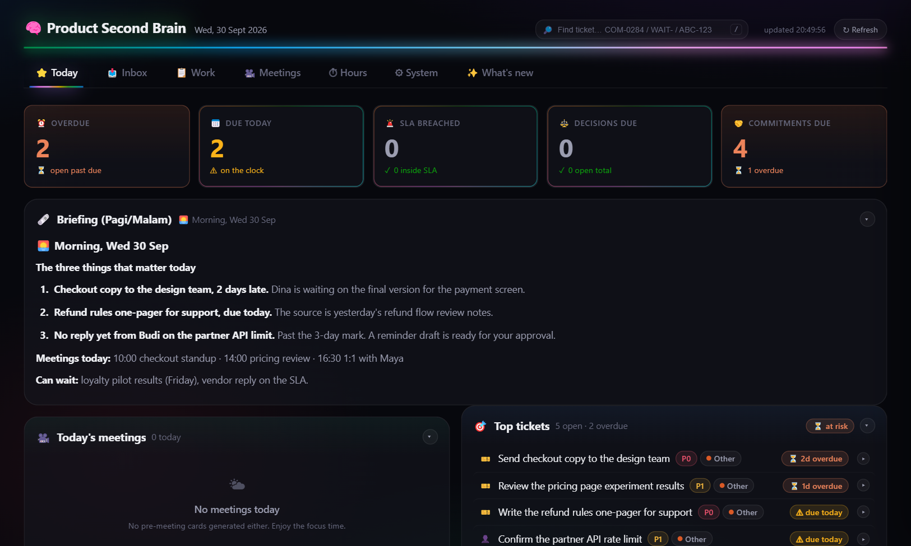

# Getting started

The shortest path from a fresh clone to a first useful draft. For connectors and authentication, see [SETUP.md](SETUP.md).

## 1. Clone and install

The installer checks your tools, creates `CLAUDE.md` from the template and prepares `.env`. It never overwrites a file you already customized.

```bash
git clone https://github.com/BrianArfi/ai-second-brain.git
cd ai-second-brain
bash install.sh
```

## 2. Start Claude Code and let it get to know you

```bash
claude
```

Then type:

```
/setup
```

It interviews you one topic at a time and writes your `CLAUDE.md`. To do it by hand instead, edit `CLAUDE.md` with [CUSTOMIZING.md](CUSTOMIZING.md) next to you. Set the **Timezone** line in `CLAUDE.md` to your IANA zone, for example `Europe/London`. `/daily-update` reads it to choose between morning and evening mode.

## 3. Start asking

No connectors are needed yet. This path takes about 15 minutes, with no API keys and no OAuth:

```
Draft a one-page brief for Thursday's budget review from my notes in notes/.
```

## 4. Connect your real tools when you are ready

Follow [SETUP.md](SETUP.md) for Google, Slack, calendars and Jira. Connect only the ones you use. Budget 2 to 4 hours, mostly for Google OAuth. Meeting notes are covered by the built-in local recorder ([MEETING_RECORDER.md](MEETING_RECORDER.md)), so there is no meeting tool to sign up for.

## Try the dashboard first, on your machine

The local dashboard needs no connector and no pip install. From the repo folder:

```bash
python3 dashboard/server.py
```

Open <http://localhost:3737>. The tabs render straight away and fill in as your notes, meetings and trackers build up. [DASHBOARD.md](DASHBOARD.md) explains which file feeds which panel.


