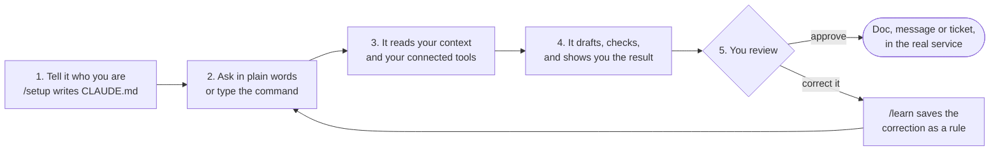

# How it works

## AI can now run your routines, not only chat

Meeting notes, morning priorities, weekly reports, reply drafts. An AI agent in your editor can do all of it and put the result straight into your Google Doc. There is one condition: the system around it has to exist first. It needs your context, your tools and your procedures.

AI Second Brain is a template for Claude Code that turns your editor into a work partner. It reads a profile of who you are, reaches the tools you connect (Google Docs, Drive, Slack, Calendar, Jira, meeting recorders), and runs your recurring work as saved procedures. It shows you each draft, and nothing is sent until you approve it.

## The problem: building that system yourself starts from an empty folder

- You open an empty folder. Which command first? Which rules? You do not know where to start.
- You copy someone else's setup from a video. It does not fit your work.
- Every Friday you type the same prompt for the weekly report, again, then paste in meeting notes one by one.
- Eight meetings this week. The action items are scattered, and nobody wrote down who owns what.
- You correct the AI on Monday. On Thursday it makes the same mistake, because a new chat starts from zero.

The setup is the hard part, so most people never get past the chat box.

## The fix: start from a system used for real work

This repo is that setup, taken from daily product work and cleaned up for anyone to fork. It ships the profile file, the saved procedures, the connectors and the guardrails. You describe who you are once, connect the tools you already use, and ask in plain language. A natural request follows the same procedure as the slash command, because `CLAUDE.md` routes both to the same file.

| Before | After |
| :--- | :--- |
| Start from an empty folder | Start from a system used for real work |
| Explain your context in every new chat | Fill in your profile once. It reads it before every task |
| Monday morning, ten tabs open to build a report | Ask for the report. Review it in a Google Doc |
| Make the same correction every week | Correct it once, and the next session already knows |

## Who it is for

People whose week is full of repetitive, structured deliverables: product managers, consultants, founders, operators and team leads who live in meetings, Slack and Google Docs. You need to be a little comfortable with a terminal to install it. After that you talk to it. If you want AI that does the work in your real tools, not a chat box that talks about it, this is for you.

## The daily loop

1. **Tell it who you are.** Open the folder in Claude Code and run `/setup`. It interviews you about your work, projects, team and rules, then writes `CLAUDE.md` for you.
2. **Ask in plain words.** `"Write meeting notes from this morning's call."` You do not have to memorize commands. Typing `/meeting-notes` does the same thing.
3. **It reads your context and tools.** It pulls the transcript from your meeting recorder, your notes, and whatever you connected: calendar, Slack, email, tickets.
4. **It drafts, checks, and shows you.** Big jobs fan out to cheaper subagents that read in parallel. A reviewer subagent checks the draft against your rules before you see it.
5. **You review.** Approve, and it creates the Google Doc or sends the message as you. Correct it, then run `/learn`, and the lesson is kept for every future session.

The full list of commands is in [COMMANDS.md](COMMANDS.md). The layers, the capability catalog and the cost model are in [ARCHITECTURE.md](ARCHITECTURE.md).

## It learns you

A new chat starts from zero. This one carries two kinds of memory. `CLAUDE.md` is the memory you write: your role, your projects, your languages, your house rules. `/learn` is the memory it writes for you: correct it once, confirm the lesson, and the next session already knows. A fresh copy does not start blank either. [`CLAUDE.md.template`](../CLAUDE.md.template) ships a **Standing Rules** section from months of daily use: do the work instead of reporting on it, never claim an action that has not happened, verify before reporting, treat a question as a question, answer first and stop.
