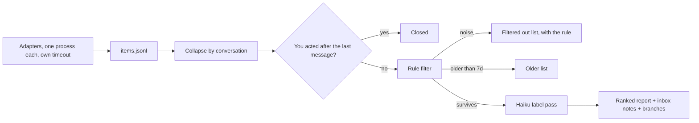

# Sweep v2: every connected source, minus the noise

Status: live as PSB `/sweep`. In ASB 1.2.0 (`main`, tag `desktop-v1.2.0`): Windows and Linux staged, macOS build pending, then promote and the member-area row. Owner: the owner. Node: `root-harness`.

## The decision for the owner

1. **Make v2 the PSB `/sweep` now** (already wired in `.claude/commands/sweep.md`) and run it next to the old habits for three days, 30 Sep to 2 Oct. Recommended: yes.
2. **Release ASB 1.2.0 with it** after those three days, if recall holds. That is a local build via `tools/release_local.py`, then the `asb_releases` SQL row for you to paste. It is an outward action, so it waits for your go.

## What changed

The old sweep was the Slack mention ledger plus Gmail. Everything else was bolted on by hand each run, and 29 Sep needed three hand passes. v2 has one engine and one adapter per source.

| Source | What surfaces | How (PSB) | How (ASB member) |
| :--- | :--- | :--- | :--- |
| Slack | Mentions, DMs, group DMs, **threads you posted in** with a reply after yours | mention ledger + `slack_threads` adapter (10 days) | Slack card, same rules in the protocol |
| Gmail | Inbox threads, 3 days, last message not yours; To vs Cc | Gmail API | Gmail card |
| Jira | Assigned, reported, watched with a new comment; new tickets assigned; any ticket a "mentioned you" mail names | both sites via `jira_client` (ExampleVendor is not on the MCP) | Atlassian card |
| Confluence | Page and comment mentions | notification mail, collapsed per page | Atlassian card |
| Google Docs, Drive | Comments that mention you or assign an action item; share requests | notification mail and the Slack Drive app, collapsed per doc; `access_watch` verifies shares | Drive card |
| Calendar | Invites with no RSVP, 14 days, recurring series as one item | Calendar API (work profile) | Calendar card |
| Linear | Unread notifications | Linear API | Linear card |
| GitHub | Review requests | `gh` | GitHub card |

## How it works

- **Item contract.** Every adapter writes the same shape: `source, conversation_key, actor, ts, text, link, why_me, is_self`. `why_me` is one of mention, dm, thread_participant, assigned, reporter, watcher, doc_comment, action_item, share_request, rsvp, review_request, cc. Full contract in the docstring of `sweep_core.py`.
- **One item per conversation.** A thread, DM, ticket, doc or recurring invite is one item. A Jira or Docs notification mail carries `collapse_into` and joins its ticket or doc.
- **Auto-close.** Adapters emit your own latest message as `is_self`. If it is newer than the last inbound message, the item is closed. That generalises what the mention ledger did for Slack only.
- **Rule filter** (deterministic, in this order): allow list; bots; deny senders (no-reply, marketing) unless the sender is a signal notifier (Jira, Docs comments, Drive shares); calendar mail already covered by the calendar source; watch-only notification mail; reactions; calendar accept/decline; Gmail Promotions/Social/Updates; deny patterns (webinar, "prompts made for you", export ready); bulk mail with List-Unsubscribe; emoji-only; short acks and thank-yous with no question, including "thannnk yooou"; a thread reply that tags someone else and not you; stale (no mention and quiet 5+ days, anything 21+ days).
- **Nothing is hidden.** Every drop lands in the collapsed "Filtered out (n)" list with its rule. `sweep_core.py teach --allow/--deny/--vip` edits `filter.json`, which is committed.
- **Label pass.** A haiku subagent labels survivors `blocking_someone | needs_decision | needs_reply | fyi | noise` with a one-line reason ([`label_prompt.md`](C:/Users/you/.gemini/antigravity/scratch/product-second-brain/.agent/skills/sweep-engine/label_prompt.md)). Rank = label + why_me + VIP (YourManager, Julie, Teammate) + a small age bump.
- **Resilience.** Slack calls honour `Retry-After` on HTTP 429 and `ratelimited` bodies. Each adapter runs as its own process with a timeout (threads 420 s). The thread pass reads newest threads first under a 300 s budget and says how many it skipped. A ledger lock held by cron skips the refresh with a note. Any failed or skipped adapter is named in the report's Sources block.

## Measured on 29 Sep 2026

**Rule layer on the labelled set** (`eval/labelled_2026-09-29.jsonl`, 148 rows from the three 29 Sep sweeps, 23 actionable, 29 FYI, 88 noise, 8 Drive-app notices relabelled as doc signals):

| Metric | Result | Target |
| :--- | :--- | :--- |
| Actionable asks kept | 23 of 23 | all |
| FYI kept | 29 of 29 | all |
| Noise dropped by rules | 85 of 88 | most |
| Noise left before the label pass | 5.5% of what is kept | under 10% |

The 3 noise rows left are human summaries in the FYI notes ("Ines thanks in #f-team") with no message text for a rule to read.

**Live run, 20:34 WIB** (all sources except Linear): 374 messages became 164 conversations. 3 closed because you had already answered, 63 filtered by rule, 28 moved to Older, 70 went to the label pass. Haiku labelled 32 actionable (3 blocking, 19 decision, 10 reply), 26 FYI, 12 noise. Reading the 32 by hand, about 3 are not asks (YourManager "Yes in", Teammate's forwarded event invite, Teammate's "updates are in the sheet"), so noise in the actionable list is about 10%, at the target line. A fourth ("Thannnnk yoooou") is now caught by the rules.

**The six thread items the ledger missed:** Noha (#temp-work-x-omniful), Teammate (DM) and Teammate's Q3 recap question (DM) surface as actionable. Teammate (#proj-b2c-whatsapp-otp) surfaces as FYI, the same label the hand pass gave it. Teammate (#newbiz-pif-2026) and Teammate's SACO date closed correctly: you replied in both threads this afternoon. Teammate (#work-seller-portal) was labelled noise by haiku where the hand pass said FYI; the label prompt now says a teammate's status update is FYI. That fix is not yet re-measured.

## Fix pass, 30 Sep 2026

A review found twelve ways v2 could drop a real ask or show it twice, and asked for the report to carry less junk. All of it is in PSB `3a6f1d568` and in ASB 1.2.0.

| Problem | Fix |
| :--- | :--- |
| An item left the adapter's window (Gmail and Jira read 3 days) and vanished unanswered | Open items are carried forward. One closes only when a source that ran cleanly, and read far enough back, stops reporting it. Adapters now report `coverage_days` and `complete`. |
| Any reply closed the whole thread, "will check tomorrow" included | A reply that tags one person leaves another person's question open. A deferring reply is a promise, listed on its own. Slack threads where your last word is a promise are now collected. |
| An unanswered question with no @mention was binned as stale after 5 days | Stale applies only when nobody asked you anything. 21 days unanswered expires with a line saying so. |
| The model could drop a real ask as noise | Model "noise" on anything addressed to you becomes FYI. |
| `marketing`, `info@` and `updates@` dropped real people; the Updates tab dropped DocuSign | Those sender rules need a bulk signal too. E-signature senders are a signal. |
| "Covered by another source" dropped mail even when that source failed | Those two rules apply only when the source ran. |
| One doc appeared twice (title in Slack, id in Gmail) | Docs are keyed by id with the title as an alias. Ledger answers close the same thread in the thread pass. |
| Two sweeps could overwrite each other's state | The state file has a lock. |
| The thread budget skipped the oldest threads first | Threads already open are read first. |
| `filter.json` had the wrong Work address | `you@yourcompany.com` added. |
| An ASB member with an empty `me` block never closes anything | The report warns when none of your replies were found. |
| "Needs decision" was inflated, 19 of 32 | The prompt needs an explicit choice, reads your last reply, and needs a reason naming who wants what. A cc-only or watch-only item cannot be marked as needing you unless it names you. |

**Less junk:** only new or changed items are listed in full, capped at 7, with several items from one person on one line (names matched across tools, so "Lamya Al Tahrawe" and "Lamya Tahrawe" are one person). Still-open, FYI, promised, older and filtered items are counts with a collapsed list; the filtered count is broken down by rule. After 3 dismissals or 5 expiries from one sender or channel with no reply, the report suggests a mute. Once there are two weeks of history, it prints how many flagged items you acted on; under 70% means junk is getting through.

**Re-measured:** 31 unit tests pass. The 29 Sep eval still keeps all 23 real asks and drops 85 of 88 noise rows. First live run after the fix: 631 conversations, 60 new for you before labelling (7 shown in full), 27 older, 55 filtered. A second run over Slack threads and Gmail found 10 promises you made ("i'll schedule early tomorrow") that the old version closed as done.

## Limits of this analysis

- The labelled set is one day, Slack-heavy (134 of 148 rows), and its noise is mostly bot pings. It proves the rules do not drop real asks; it does not prove they catch every kind of noise.
- The 10% figure is one haiku run read by me, not a second labeller.
- Linear did not run: the script connector has no `LINEAR_API_KEY` in `token.env` (the MCP card works, the script does not use it).
- Docs comments arrive only through notification mail and the Slack Drive app. A comment with no notification is not seen.
- Jira status changes on your tickets without a comment are not surfaced yet.
- Meeting action items are not an adapter in PSB, because the commitment ledger already captures yours.

## Where it lives

- PSB: `.agent/skills/sweep-engine/` (`sweep_core.py` stdlib core, `adapters_psb.py`, `run_sweep.py`, `filter.json`, `label_prompt.md`, `test_sweep_core.py`, `eval/`). State `journal/sweep/state.json`, report `journal/sweep/latest/report.md`.
- ASB app, `main` from 1.2.0:
  - `workspace-template/sweep-engine/` ships the same core, the label prompt, and an empty `filter.json`.
  - New managed block `managed/sweep.md`, listed in `MANAGED_SECTIONS`, so every existing workspace's `CLAUDE.md` gets the protocol on app start and it outranks the old `/inbox-sweep`. Commands are offered once and never overwritten, so this block is the only route to existing members.
  - `sync_template_sweep_engine` ships and upgrades the engine with the recorder's ownership rules: `filter.json` is never overwritten, an edited file is left alone, and a harness with its own `.agent/skills/sweep-engine/` is skipped.
  - `commands/inbox-sweep.md` and the template `CLAUDE.md` describe the wider sweep for new workspaces.
  - Members collect through their connected cards and write the JSONL; the engine runs on `$ASB_PYTHON`.

## Next steps

1. 30 Sep to 2 Oct: every `/sweep` runs v2. Anything you find by hand that v2 missed goes into `eval/` as a row, and the rules or prompt get a fix the same day.
2. 2 Oct: re-run `sweep_core.py eval`, re-read the live actionable list, then ask you for the release go.
3. On go: bump to 1.2.0, `tools/release_local.py`, hand you the `asb_releases` SQL row, then `/sync` the public template.
